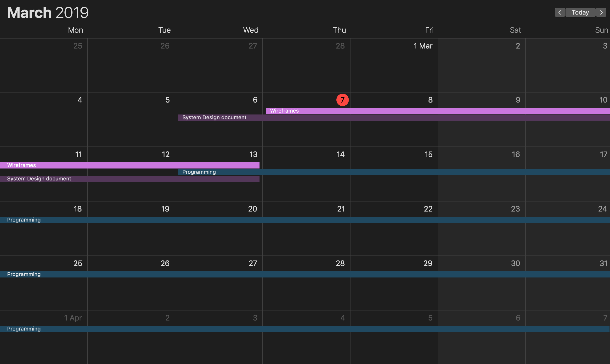
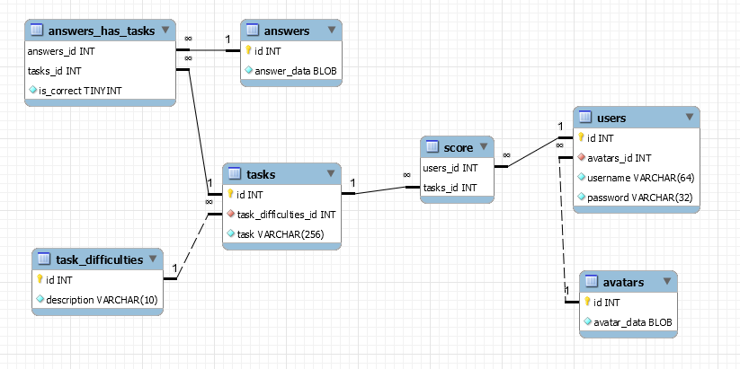

# System Design

------

## Introduction

"Maths Sucks" is a an interactive online Mathematics game for students who are currently in Primary, Secondary and Tertiary level. It is a vibrant and new way of learning mathematics with the help of visual aids and fun games. The purpose of "Maths Sucks" is to bring fun into learning mathematics and try to simplify the complicated theories in mathematics.

With the help of new age technology tools ,our product will provide a more simple, interactive and friendly interface. Combining the class 2D game structures and mathematics the user will be able to enjoy learning and also get a taste of classic games fun.

#### Purpose

This Software Design document is intended to design the features of the educational game into a document visually in which we will define the structure, functionalities, design patterns, application content etc.

The people for which this document is prepared for are:

1. Administrator
2. Students

#### Scope

1. The product which we are producing is
    - "Maths Sucks"

2. Activities perfomed by our Software product
    -Interact with user
    - Allows moving a character to pick a answer
    - Compute mathematical questions
    - Indicate if answer is correct
    - Give solutions
    - Give feedback/Progress of user
    - Allows changing of settings
    - Store basic information of the user

3. Activities not done by the system yet due to time limitation
    -
    -
    -
    -

#### Overview

Now our online game will be computerized which will overcome the problems of manual system and this will make our game efficient. Using different packages of database and OOP programming languages will make our work much more easier than manual work.

There are few criteria for doing any specific kind of task. Detailed information is necessary for performing any kind of activity in the whole information system. For example to start playing the game, you must login first into the system by the use of user name and password. If the  user name and password is correctly entered, you can start playing the game otherwise the user will not be allowed to play the game.

As the login is succesful then different options in the form of choice and buttons should be available to the user for performing different activities related to the game.

You should be able to pick the option to play or "option" to change the setting of the game. 

Picking the option to play takes you to a form that will ask you to pick the diffculty level of the game. Depending on the difficulty level , you will receive mathematical questions relating to that.

Should you pick the "option"  button then you will be taken to a form that will allow you to change the setting of the game, which are :
    -Change the volume
    -Change the display
    -Mute option
    -Change difficulty level

When already playing you can exit, the game by clicking on the exit button.

#### Reference Material
In this subsection

The information used and abbreviations are taken from
    https://www.youtube.com/watch?v=dKZSs7SShuM&list=WL&index=14&t=1s
    Software requirement specifications: Amazing Lunch Indicator by (Sarah Geagea 881024-4940 Sheng Zhang 850820-4735 Niclas Sahlin 880314-5658 Faegheh Hasibi 870625-5166 Farhan Hameed 851007-9695 Elmira Rafiyan 840724-5383 Magnus Ekberg 851022-1933)

#### Definitions and acronym

User : Someone who interacts with the online webbased game.
Admin/Administrator: System administrator who is given specific permission for managing and controlling the system

## General Overview and Design Approach
We are going to use one of the agile development methodologies, namely S.C.R.U.M methodology. And we will take this approach becasue it is well suited to our project, meaning that we might mkae modifications during the development process of the project and we took this approach also becasue of the additional features and possible challenges we may face in this development process.

------

## Project plan

1. Game Project
2. Scrum Master : Rayne Blair
3. Team Memmbers: Aziz Gasimov , Maksat Baigazy, Miklos Kovacs, Amer Mamoun , Xolani Nhlapo, Rayne Blair
4. Deadline for all tasks are the same: 20/06/2019
5. Estimated Budget for the project is 20.000.000 Ft

6. Project plan:

- 2019.02.13
    - Project started, Setting up gitlab and folder structures. Start writing requirement specification.

- 2019.02.20
    - Finished with requirement specification. Deciding on how project will look like, deciding database plan and started writing functional specification.

- 2019.02.27
    - Functional specification document finished. Deciding roles in the team. Discussing project.

- 2019.03.06
    - Starting with System design document.

- 2019.03.07
    - Starting with Wireframes

- 2019.03.13
    - Finishing with SDD, designing wireframes and finish them, starting to program.

Project plan as image:

- 

------

## Database design

The main entities in the database are the following:
- Users
- Tasks
- Answers

These main entities are taken into some separate parts. It can be clearly seen in the following diagram:


### **Entities**

#### *Users*

Users are defined by the following data: id, avatars_id, username, password. The avatars - which are closely connected to the users - are descriped by the following data: id, avatar_data.
```json
{
    "users": {
        "id": "INTEGER, PRIMARY KEY",
        "avatars_id": "INTEGER, NOT NULL, FOREIGN KEY REFERENCES(avatars.id)",
        "username": "VARCHAR(64), NOT NULL, UNIQUE",
        "password": "VARCHAR(32), NOT NULL, [MD5 format]"
    },
    "avatars": {
        "id": "INTEGER, PRIMARY KEY",
        "avatar_data": "BLOB [images will be stored here], NOT NULL"
    }
}
```

#### *Tasks*

The tasks are defined by the following data: id, task difficulty, assigned answers. The task difficulties are defined by the following data: id, description.
```json
{
    "tasks": {
        "id": "INTEGER, PRIMARY KEY",
        "task_difficulties_id": "INTEGER, NOT NULL, FOREIGN KEY REFERENCES(task_difficulties.id)",
        "task": "VARCHAR(256), NOT NULL, UNIQUE"
    },
    "task_difficulties": {
        "id": "INTEGER, PRIMARY KEY",
        "description": "VARCHAR(10), NOT NULL, UNIQUE"
    }
}
```

#### *Answers*

The answers in the database are defined by the following data: id, answer_data.

```json
{
    "answers": {
        "id": "INTEGER, PRIMARY KEY",
        "answer_data": "BLOB, NOT NULL"
    }
}
```

### **Main relations**

#### *Answers has tasks*

Answers can be assigned to tasks. The correct or not logical value is stored in the relation table as well. Answers are defined by the following data: answers_id, tasks_id, is_correct. The answers_id, tasks_id are a combined key pair.

```json
{
    "answers_has_tasks": {
        "answers_id": "INTEGER, PRIMARY KEY, FOREIGN KEY REFERENCES(answers.id)",
        "tasks_id": "INTEGER, PRIMARY KEY, FOREIGN KEY REFERENCES(tasks.id)",
        "is_correct": "TINYINT [used as boolean], NOT NULL"
    }
}
```

#### *Score*

Score is a calculated value in the database and it is defined by the following values in the score table: users_id, tasks_id. Users_id nad Tasks_id gives a combined key to the table.

```json
{
    "users_id": "INTEGER, PRIMARY KEY, FOREIGN KEY REFERENCES(users.id)",
    "tasks_id": "INTEGER, PRIMARY KEY, FOREIGN KEY REFERENCES(tasks.id)"
}
```

------

## User Interface

------

## Goal of the system

The main Goal of the Project to practice how to work in team in the first place and how to use gitlap and Trello as managment tools for our project.
The system will contains a front end and backend.

The Goal of this project is educational, Basicly for school students to the universiy students also this could apply for the employees in the work environment so the can practice for some mathimatics excercises which will help them to refresh thier information with mathimatics.

- Retain talent
87% of business leaders say retaining top talent is a key business priority. At the same time, 65% of employees say access to training opportunities would increase their company loyalty. But! No one wants to spend hours clicking through boring, generic content slides! They want engaging and meaningful development opportunities. And gamification projects give employees access to the training they desire! Gaming mechanics such as Badges, Experience Points (XP) and Leaderboards infuse the learning experience with clear goals, motivating rewards and healthy competition.

- Knowledge sharing
When employees retire they take all their intellectual capital with them! Gamification projects help teams to share knowledge with each other in an engaging way. The person with the most points tops the Leaderboard. This way everyone can see who really knows their stuff and whose brain to pick. It’s also the perfect way to spot the subject matter experts of the future!

------